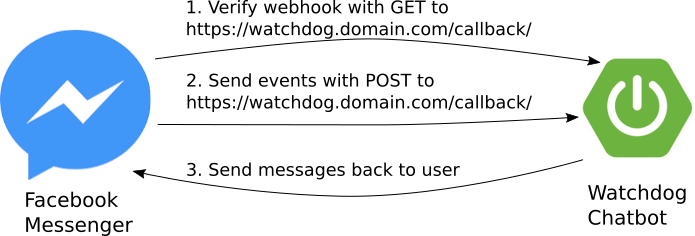
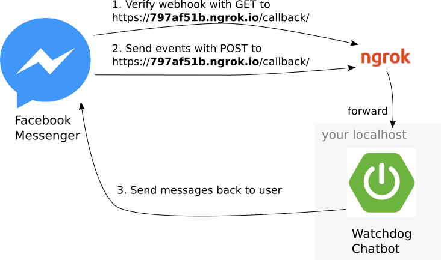

# Java Messenger Watchdog

This is an simple app to demonstrate how implement a chatbot for messenger in Java. I try to
explain everything as clear as possible. From the Facebook Developer Setup till deployment.

## Broad overview

We will build a chatbot that integrates with facebook as described in the following diagram:



1. When you will setup your webhook, Facebook will fist call your URL using an http GET request to 
verify that is you who wanted to set the webhook to this url. You should answer with an http status
200 if the webhook may be configured.

2. Then all events from Facebook Messenger will be sent to your webhook using http POST requests.

3. If you want to send something back to your user, you have to make calls back to Facebook.

As a webhook you can only declare a https connection with a valid SSL certificate. This makes it a
bit more difficult if you want to run your bot locally as you probably don't have a valid 
certificate on your machine. But here is a workaround with the project [ngrok](https://ngrok.com/).
In this case the deployment looks a bit different:



You can run your local `ngrok` process with following command:

```
$ ngrok http 8080
```

It will output following lines:

```
ngrok by @inconshreveable                                (Ctrl+C to quit)

Session Status                online
Version                       2.2.8
Region                        United States (us)
Web Interface                 http://127.0.0.1:4040
Forwarding                    http://797af51b.ngrok.io -> localhost:8080
Forwarding                    https://797af51b.ngrok.io -> localhost:8080
```

Now you have your own ngrok domain and certificate. Just use following url als your webhook:
`https://797af51b.ngrok.io/callback`

## Setup at Facebook

There are a few things that have to be done before you can start:

### Facebook account
Of course you need a Facebook account.

### Facebook page
Facebook Chatbots are always bound to a Facebook page. Create a new page specifically for your bot.

### Developer account
You need a developer account to create a Facebook App. Go to (https://developers.facebook.com/) to 
create yours.

### Facebook app
At last you need a Facebook app. On (https://developers.facebook.com/) at the upper right corner
you can create your new app.

### Connect app and page
Now your app needs to be connected to your page. Therefore click `add product` and choose
`Messenger`.

At `Key generation` you can choose your site and let facebook generate a page access token. You
need this token later.

The next section is about webhooks. You should create a webhook and enter following parameters:

- Webhook-URL: The URL to your server. For example `https://my-app.mydomain.com/callback`. If you 
  run your app on your local development machine you should use `ngrok`.

- Verify token: A token string of your choice. Facebook will send you this token to verify the
  webhook setting. This protects you against other sites who may want to use your bot without your
  permission.

- Finally you choose your field subscriptions. Here you can define which events should be forwarded
  to your webhook.
  
Finally you should go back to the app dashboard and find the app secret. You will need it in your
java project.

